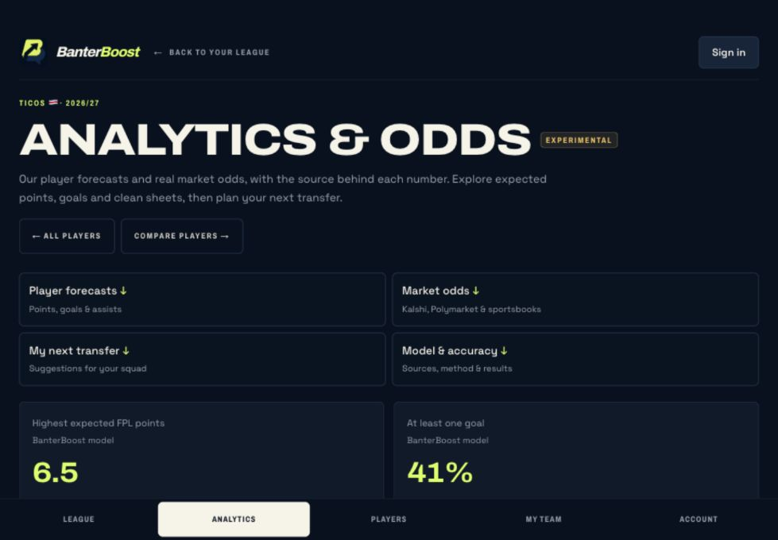

# Adi Rosenstock

**Software engineer and data scientist building products where software, markets, and football meet.**

I’m a Northwestern student studying Computer Science, Data Science, and Economics. I’ve built financial data systems at Bloomberg, shipped my own products, and used machine learning and statistical models to answer questions I care about. I like taking an idea all the way from messy data or a rough sketch to something people can use.

[Explore my portfolio](https://adirosenstock.github.io/) · [GitHub](https://github.com/AdiRosenstock) · [LinkedIn](https://www.linkedin.com/in/adirosenstock) · [Email me](mailto:adirosenstock2026@u.northwestern.edu)

## A few things I’m proud of

| | What I did |
| --- | --- |
| **Bloomberg** | Built Python and SQL reconciliation pipelines covering **2.3M+ financial records** across **860 companies**. AI agents and a custom MCP server helped automate investigation of **71% of flagged cases**. |
| **BanterBoost** | Founded and engineered a live Fantasy Premier League product with player forecasts, league analytics, and an AI pundit. |
| **Airbnb classification** | Placed **2nd of 124** in a Northwestern machine learning competition with a **0.9908 ROC-AUC** CatBoost model. |
| **IMC Prosperity 3** | As part of Team Literal Zero, finished **1st in Central America and the Caribbean** and **3rd in Latin America** in a simulated trading competition. |

The Bloomberg figures come from my internship work; the IMC rankings belong to our team.

## Selected work

### [BanterBoost](https://fplbanterboost.com) · Founder and sole engineer

Fantasy Premier League is more fun when the banter has numbers behind it. I built BanterBoost to bring live mini-league views, player forecasts, analytics, and an AI pundit into one product. The stack includes **Next.js, TypeScript, and PostgreSQL**.

[Try the live product](https://fplbanterboost.com) · [See it in my portfolio](https://adirosenstock.github.io/#projects)



### [Career Agent](https://github.com/AdiRosenstock/career-agent-public) · Creator

An open-source, local workspace for researching jobs, preparing sourced answers, and completing applications. I built the **React, Express, TypeScript, and SQLite** application and its shared workflow, **The Goat**, for Codex and Claude Code. Candidates choose whether to submit themselves, approve an exact batch, or authorize automatic submission after a separate warning. An approval applies to an exact packet version, and submissions need confirmation evidence.

[Read the project story](https://adirosenstock.github.io/projects/career-agent/) · [Explore the source](https://github.com/AdiRosenstock/career-agent-public)

### [Brief Intelligence](https://adirosenstock.github.io/projects/brief-intelligence/) · Northwestern Pritzker School of Law team project

We built a legal research tool for Professor Maria Amparo Grau Ruiz at Northwestern Pritzker School of Law. It helps researchers search more than 20,000 EU court cases by title, identifier, and abstract, then narrow results by topic and year. My work centered on search and the results interface. The application repository is private; the public [demo](https://www.youtube.com/watch?v=GVULpFCQ97A) and [team classification pipeline](https://github.com/ZBraffmanNorthwestern/briefintelligence) show the project without sharing private configuration.

### More projects

| Project | What to explore |
| --- | --- |
| [Airbnb Superhost model](https://adirosenstock.github.io/projects/airbnb-classification/) | My feature engineering, model comparisons, five-fold validation, and [full analysis](https://adirosenstock.github.io/Airbnb-Classification-Problem-Kaggle/Airbnb_Classification_Problem.html). |
| [IMC Prosperity 3](https://adirosenstock.github.io/projects/imc-prosperity/) | Our team’s Python trading strategies, options pricing, and [candid five-round write-up](https://github.com/AdiRosenstock/IMC_Prosperity_3). |
| [DOMUS](https://adirosenstock.github.io/projects/domus/) | A [WildHacks team project](https://github.com/AdiRosenstock/DOMUS) connecting guests and hosts for Shabbat dinners and cultural gatherings. |
| [TikiData FC](https://adirosenstock.github.io/projects/tikidata-fc/) | My [football data notebooks and visuals](https://github.com/AdiRosenstock/TikiData.FC) on expected goals, player form, and emerging talent. |
| [STAT 362: Advanced Machine Learning](https://github.com/AdiRosenstock/STAT-362-Advanced-Machine-Learning) | Northwestern coursework: notebooks on gradient descent and SVMs, plus a logistic regression model implemented from scratch. |

## About this site

This repository is the source for [adirosenstock.github.io](https://adirosenstock.github.io/). I built it as a dependency-free static site with interactive project stories, a live BanterBoost preview, responsive layouts, keyboard-friendly controls, and a motion pause option. The football details are personal: I captained Furati FC in Costa Rica’s U20 second division, and the game still shapes what I build.

### Run it locally

```sh
npm run dev
```

Open <http://127.0.0.1:4173>. The deployable site lives in `dist/`; there is no install or build step. Before pushing changes, run:

```sh
npm run check
```

Pushes to `main` publish through [GitHub Pages](.github/workflows/pages.yml). For asset, interaction, content-source, and deployment details, see [site notes](docs/site-notes.md).

## Say hello

If you’re building something at the intersection of software, data, product, or sport, I’d love to hear about it: **[adirosenstock2026@u.northwestern.edu](mailto:adirosenstock2026@u.northwestern.edu)**.
